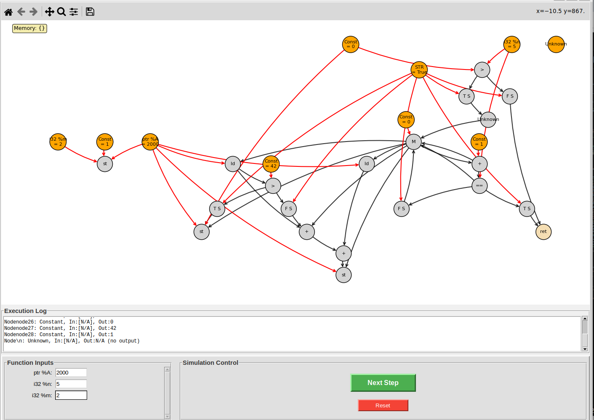

# Data Flow Graph Visualizer/Simulator

Test your .dot dataflow graphs by stepping through their execution.

### Example:

```shell
python3 visualizer.py
```

#### Window:



#### TODO:
 * Increase spacing between some nodes
 * Add a scrollable text display logging feature on the screen under memory to display every op and its result
